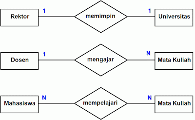
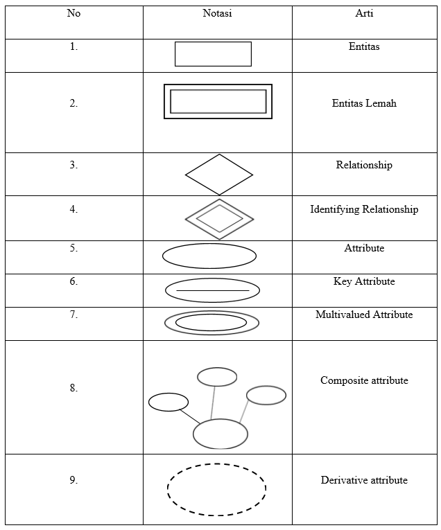
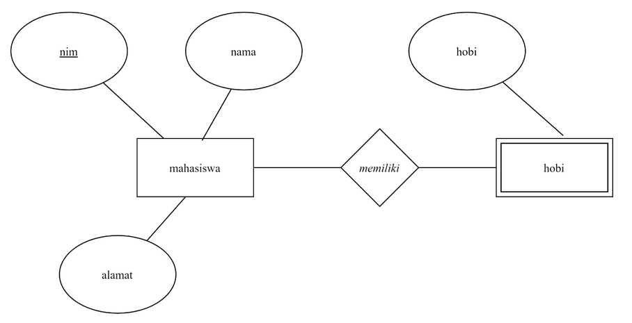
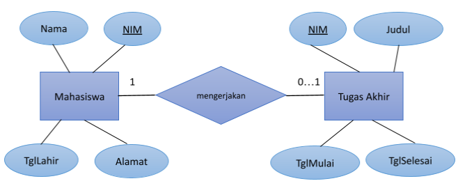
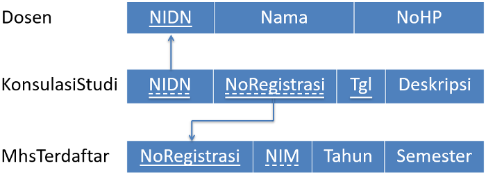
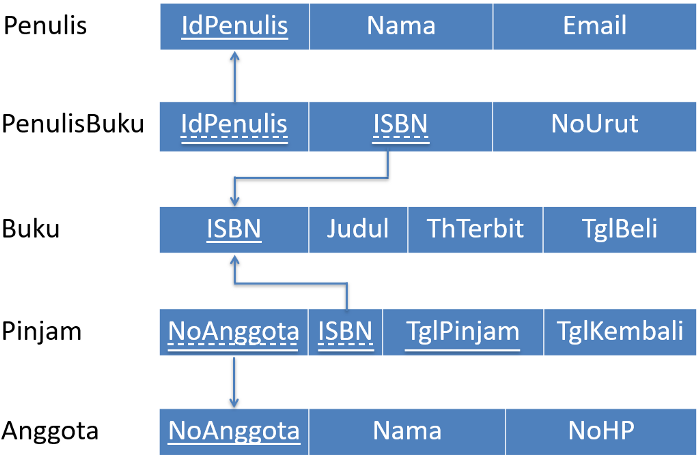
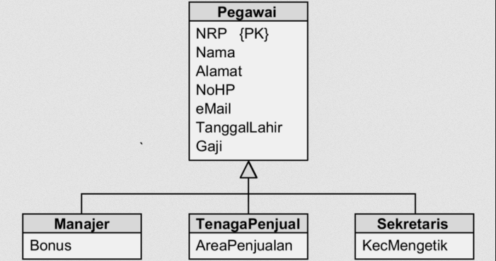

# KONVERSI ERD DALAM BENTUK TABEL ENTITAS

## Daftar Isi
- [ERD Chen](#1-erd-chen)
- [ERD Crow's Foot](#2-erd-crows-foot)
  - [Entitas](#1-entitas)
  - [Atribut](#2-atribut)
  - [Primary Key dan Foreign Key](#3-primary-key-dan-foreign-key)
  - [Relasi](#4-relasi)

## 1. ERD Chen
Notasi Chen  menggunakan berlian dan menghubungkan garis dengan simbol untuk menggambarkan hubungan dan kardinalitas. Atribut juga dapat ditampilkan sebagai oval.
Kardinalitas pada notasi Chen:
 - One-to-one (1:1) – kedua entitas hanya terkait dengan satu atribut entitas lain.
 - One-to-many (1:N) – satu entitas dapat dikaitkan dengan beberapa nilai entitas lain
 - Many-to-one (N:1) – banyak entitas yang terkait dengan hanya satu atribut dari entitas lain.
 - Many-to-many (M:N) – beberapa entitas dapat dikaitkan dengan beberapa atribut entitas lain

Bentuk Notasi Chen:

### A. Entitas
Kumpulan objek yang dapat diidentifikasikan secara unik atau saling berbeda. Biasanya, simbol dari entitas adalah persegi panjang. Jenis-jenis entitas dibagi menjadi dua jenis yaitu: 
 + Entitas kuat adalah entitas yang eksistensinya tidak bergantung pada entitas lain. 
 + Entitas lemah adalah entitas yang eksistensinya bergantung pada entitas lain. Entitas lemah tidak memiliki atribut key yang berfungsi sebagai primary key.

 

Entitas mahasiswa sebagai entitas kuat karena dia tidak bergantung pada entitas yang lain dan memiliki atribute key yang bertindak sebagai primary key yang ditandai dengan tulisan bergaris bawah yaitu nim.
Sedangkan entitas hobi merupakan entitas lemah karena dia keberadaannya tergantung pada entitas mahasiswa. Dan dia tidak memiliki atribut yang menyatakan bahwa itu primary key.

### B. Atribut
Komponen kedua dari ERD adalah atribut. Setiap entitas pasti mempunyai elemen yang disebut atribut yang berfungsi untuk mendeskripsikan karakteristik dari entitas tersebut. Atribut kunci merupakan hal pembeda atribut dengan entitas. Gambar atribut diwakili oleh simbol elips dan terbagi menjadi beberapa jenis:
 + Atribut kunci (key): atribut yang digunakan untuk menentukan entitas secara unik. Contoh: NPWP, NIM (Nomor Induk Mahasiswa).
 + Atribut simpel: atribut bernilai tunggal yang tidak dapat dipecah lagi (atomic). Contoh: Alamat, tahun terbit buku, nama penerbit.
 + Atribut multinilai (multivalue): atribut yang memiliki sekelompok nilai untuk setiap entitas instan. Contoh: nama beberapa pengarang dari sebuah buku pelajaran.
 + Atribut gabungan (composite): atribut yang terdiri dari beberapa atribut yang lebih kecil dengan arti tertentu. Contoh: nama lengkap yang terbagi menjadi nama depan, tengah, dan belakang.
 + Atribut derivatif: atribut yang dihasilkan dari atribut lain dan tidak wajib ditulis dalam diagram ER. Contoh: usia, kelas, selisih harga.

### C. Primary Key dan Foreign Key
- Primary Key
Dalam SQL database management system, primary key adalah tanda pengenal unik yang membedakan satu record dari yang lain. Oleh karena itu, setiap record dalam SQL database management system harus memiliki primary key. Tetapi ada beberapa aturan yang harus kalian ikuti ketika menentukan primary key untuk tabel:
  + Primary key harus berisi nilai unik. Jika primary key terdiri dari beberapa kolom, kombinasi value pada kolom ini harus unik.
  + Kolom primary key tidak boleh berisi nilai NULL. Ini berarti bahwa kalian harus mendeklarasikan kolom primary key dengan atribut NOT NULL. Jika tidak, MySQL akan memaksa kolom primary key sebagai NOT NULL secara implisit.
  + Sebuah tabel hanya memiliki satu primary key
- Foreign Key
Dalam SQL database management system, foreign key adalah pengenal unik atau kombinasi pengenal unik yang menghubungkan dua tabel atau lebih dalam database. Dari empat SQL database management system yang ada, relational database management system adalah yang paling populer.

Saat memutuskan tabel mana dalam database relasional yang harus memiliki foreign key, kalian harus terlebih dahulu mengidentifikasi tabel mana yang merupakan subjek dan objek dalam hubungannya.

### D. Relasi
Relasi yaitu menggambarkan hubungan antara entitas satu dengan entitas lainnya sesuai proses bisnisnya. Notasinya digambarkan dengan belah ketupat. Relasi memiliki kardinalitas relasi yang menggambarkan banyaknya jumlah maksimum entitas dapat ber-relasi pada himpunan entitas yang lain. Pada himpunan relasi biner, pemetaan kardinalitas dapat berupa salah satu dari pilihan berikut :
 + Relasi One to One
  Setiap entitas pada himpunan entitas A berhubungan paling banyak dengan satu entitas pada himpunan entitas B dan begitu juga sebaliknya.
  *Contoh :*

 

 Pemetaan ERD di atas ke model relasional menghasilkan dua relasi berikut:

 

 Diagram ER (entity relationship) berikut menggambarkan relationship antara entitas Mahasiswa dan entitas TugasAkhir. Sebuah gambar berisi teks Deskripsi dibuat secara otomatis

 

 + Relasi One to many
 Setiap entitas pada himpunan entitas A dapat berhubungan dengan banyak entitas pada himpunan entitas B, tetapi tidak sebaliknya.

 Ketentuan-ketentuan penyertaan atribut relasi:
   - Atribut-atribut relasi akan disertakan ke himpunan entitas yang mempunyai derajat relasi minimumnya yang lebih besar, atau
   - Atribut-atribut relasi akan disertakan ke himpunan entitas yang mempunyai jumlah record yang lebih sedikit
  
 *Contoh 1:*

 ERD di bawah menunjukkan relationship 1:N. Primary key “NIM” pada entitas Mahasiswa muncul pada entitas MhsTerdaftar sebagai foreign key. Relationship-nya tidak memiliki atribut.

 

 Pemetaan ERD di atas ke model relasional menghasilkan dua relasi berikut:

 

 *Contoh 2:*

 Setiap mahasiswa dibimbing oleh seorang dosen penasihat akademik (PA). Penasihat akademik ditentukan ketika calon ma­hasiswa mendaftar pertama kali sebagai mahasiswa baru. Seorang dosen PA dapat membimbing banyak mahasiswa.

 Kebutuhan data mungkin berbeda bagi setiap perguruan tinggi. Ada yang hanya perlu menyimpan data penasihat akademik setiap mahasiswa, kegiatan konsultasi studi tidak disimpan. Kebutuhan yang demikian terpenuhi melalui ERD pada Gambar 3. Primary key entitas di sisi 1 yaitu NIDN muncul di entitas mahasiswa (sisi N) sebagai foreign key, dan supaya lebih jelas, atribut foreign key dinamai NidnPA. Relationship “membimbing” tidak memiliki atribut.

 

 Pemetaan ERD pada Gambar 3 ke model relasional menghasilkan dua relasi berikut:

 

 Ada perguruan tinggi yang menyimpan data kegiatan konsultasi studi mahasiswanya di dalam basis data. Kebutuhan yang demikian terpenuhi melalui ERD pada Gambar 5, yaitu dengan munculnya atribut pada relationship “membimbing”. Foreign key “NIDN” yang berasal dari primary key “Dosen” menunjukkan dosen yang membimbing; foreign key “NoRegistrasi” yang berasal dari primary key “MhsTerdaftar”, menunjukkan mahasiswa terdaftar yang dibimbing. Atribut Tgl menunjukkan kapan konsultasi dilakukan, atribut Deskripsi mendeskripsikan konsultasi studinya. Primary key-nya komposit, gabungan atribut NIDN, NoRegistrasi, dan Tgl.

 Pemetaan ERD konsultasi studi ke model relasional menghasilkan tiga relasi berikut:

 

 

 *Kesimpulan:*

 Relationship 1:N tidak selalu memiliki atribut. Relationship 1:N memiliki atribut bila ada kegiatan (transaksi) yang ditimbulkan dan perlu disimpan datanya. Primary key entitas yang terhubung muncul di relationship sebagai foreign key.

 + Many to many
 Setiap entitas pada himpunan entitas A dapat berhubungan dengan banyak entitas pada himpunan entitas B dan demikian juga sebaliknya.

 Berikut akan dibahas contoh kasus perpustakaan pribadi yang hanya memiliki satu buku untuk setiap ISBN (International Standard Book Number). Diagram entity relationship-nya adalah sebagai berikut:

 Pemetaan diagram entity relationship di atas menghasilkan lima relasi berikut:

 

 

 *Kesimpulan:*

 Relationship M: N selalu memiliki atribut, meskipun tidak ada transaksi dalam hubungan tersebut. Setidaknya, primary key entitas terhubung muncul dalam relationship sebagai foreign key. Biasanya ada atribut tambahan lainnya.

 + Relasi Many to One
 Setiap entitas pada himpunan entitas A berhubungan dengan paling banyak satu entitas pada himpunan entitas B, tetapi tidak sebaliknya.
 
## 2. ERD Crow's Foot
Notasi Crow's Foot hanya menggunakan garis dengan simbol di ujungnya. Kardinalitas sangat penting untuk menunjukkan hubungan numerik antara entitas. 
Kardinalitas pada Notasi Crow’s Foot:
Crow's Foot memiliki hubungan ini. Meskipun logikanya sama, representasi visualnya sangat berbeda:
 - One
 - Many
 - Zero or many
 - One or many
 - One and only one
 - Zero or one

Bentuk Notasi Crow’s Foot:
 1. Bentuk Entitas

 

 2. Entitas dengan Atribut

 

 3. Kardinalitas dan Relasi

 

 

 

## Spesialisasi dan Generalisasi
- Spesialisasi
Merupakan proses dekomposisi (pengelompokkan) sebuah himpunan entitas yg melahirkan himpunan entitas baru yang dilakukan secara top-down.
 + Proses perancangan Top down; Membuat sub-grup dari entitas sehingga menjadi berbeda dengan entitas yang lain.
 + Hasil dari sub grouping adalah entitas tingkat rendah dimana salah satu atribut sebagai relasi dengan entitas diatasnya.
 + Digambarkan dengan segitiga dan diberi label ISA (Mis. Pelanggan “is a” Manusia)

 

- Generalisasi
Merupakan penyatuan beberapa himpunan entitas menjadi sebuah himpunan entitas baru. Atribut dari masing-masing himpunan entitas disatukan kedalam himpunan entitas baru.
 + Proses perancangan bottom-up – menggabungkan beberapa entitas yang mempunyai atribut yang sama menjadi entitas yang lebih tinggi tingkatnya.
 + Spesialisasi dan generalisasi adalah upaya penyederhanaan; dan dapat digambarkan dengan ERD.
 + Peristiwa spesialisasi dan generalisasi dapat diterapkan bolakbalik.

*Kesimpulan:*

Spesialisasi adalah proses mengidentifikasi perbedaan karakteristik antarentitas. Sebaliknya, generalisasi adalah proses mengidentifikasi kesamaan karakteristik antarentitas.

Agregasi  
Merupakan sebuah relasi yang secara kronologis mensyaratkan telah adanya relasi lain.

## Referensi
+ https://medium.com/telematika/relationship-1-1-b138256a4019
+ https://medium.com/telematika/apakah-relationship-1-n-memiliki-atribut-dc68e9a15465
+ https://medium.com/telematika/atribut-relationship-m-n-d4982b112546
+ https://medium.com/telematika/spesialisasi-generalisasi-pengguna-basis-data-akademik-630a4191c2cb
+ https://repository.dinus.ac.id/docs/ajar/9.materi_ERD__.pdf
+ https://repository.dinus.ac.id/docs/ajar/c-5-BD.pdf
+ http://lea.si.fti.unand.ac.id/wp-content/uploads/2018/02/Modul-6-Spesialisasi-Generalisasi-dan-Agregasi.pdf
